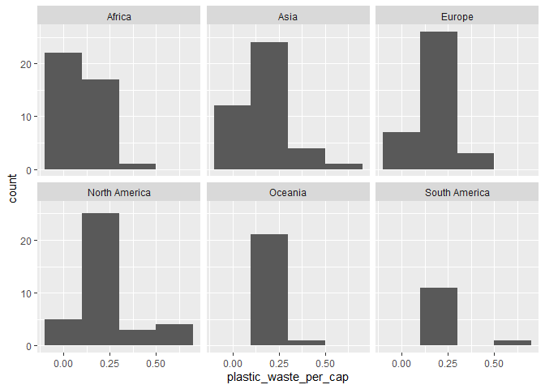
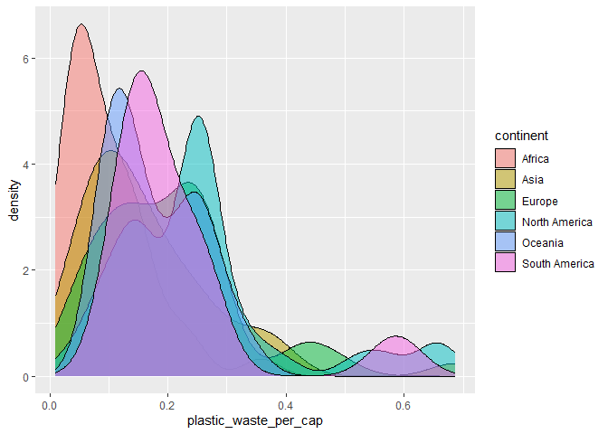

Lab 02 - Plastic waste
================
Marc-Antoine Moisan
2025-09-16

## Chargement des packages et des données

``` r
library(tidyverse) 
```

``` r
plastic_waste <- read_csv("data/plastic-waste.csv")
```

Commençons par filtrer les données pour retirer le point représenté par
Trinité et Tobago (TTO) qui est un outlier.

``` r
plastic_waste <- plastic_waste %>%
  filter(plastic_waste_per_cap < 3.5)
```

## Exercices

### Exercise 1

``` r
ggplot(data = plastic_waste, aes(x = plastic_waste_per_cap)) +
  geom_histogram(binwidth = 0.2) + facet_wrap( ~ continent)
```

<!-- -->

Nous pouvons voir que dans les continents les plus développés comme
l’Amérique du Nord et l’Europe, la quantité de déchets plastiques est
très élevée. Des continents plus en développement, comme l’Amérique du
Sud et l’Afrique, affichent une quantité de déchets plastiques moindre,
ce qui a du sens, car les continents qui ont des pays plus en
développement ont moins de moyens, donc moins de plastique à gaspiller.

### Exercise 2

``` r
ggplot(data = plastic_waste, aes(x = plastic_waste_per_cap, fill = continent)) +
  geom_density( alpha = 0.5)
```

<!-- -->

Le réglage de la couleur (color et fill) se trouve dans aes, car ils
sont souvent liés qu’à une seule variable. Par exemple les continents.
Pour le réglage de la transparence (Alpha), il se trouve hors de l’aes,
dans geom_density(), car il prend en compte toutes les variables, donc
c’est le graphique au complet qui change selon la modification demandée.

### Exercise 3

Boxplot:

``` r
# insert code here
```

Violin plot:

``` r
# insert code here
```

Réponse à la question…

### Exercise 4

``` r
# insert code here
```

Réponse à la question…

### Exercise 5

``` r
# insert code here
```

``` r
# insert code here
```

Réponse à la question…

## Conclusion

Recréez la visualisation:

``` r
# insert code here
```
